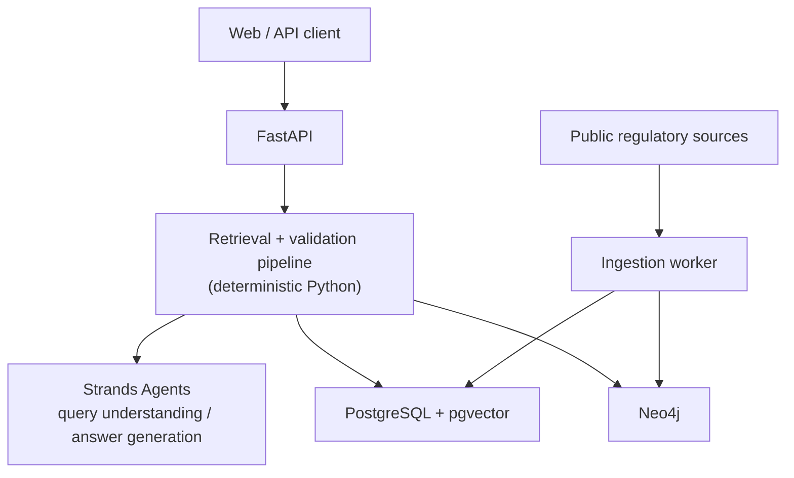

# Amend: Architecture

This document describes how Amend is built, not what it should do. Product requirements and rationale live in [PRD.md](./PRD.md); this file assumes that context and focuses on components, data flow, and technical decisions.

## 1. Component overview



Three independent concerns, each owned by a different layer:

| Concern | Owner | Why |
|---|---|---|
| Is this retrieval step correct? | Deterministic Python (`app/pipeline/`) | Needs to be testable and identical across model providers |
| What does the evidence mean, in natural language? | Strands Agents (`app/agents/`) | The only place an LLM is actually needed |
| Is the data structurally and semantically true? | PostgreSQL/pgvector + Neo4j | Storage of record, not derived state |

## 2. Why the pipeline is not a graph-execution framework

The PRD's retrieval pipeline (§19 to §24) is a linear sequence with exactly one conditional branch: retry retrieval if evidence is insufficient. A graph-execution framework (LangGraph-style `StateGraph`, or a Strands multi-agent `Graph`) buys node-level checkpointing, parallel branch execution, and durable state, none of which this pipeline currently needs.

Building it as a plain function pipeline over an explicit state object (§26 of the PRD) is simpler to test, simpler to reason about, and does not tie retrieval/validation logic to an agent-orchestration framework's execution model. If the pipeline later grows real branching or needs durable long-running state, revisit this: Strands does support a `Graph` multi-agent pattern for that case.

```python
def run_query(state: PipelineState) -> PipelineState:
    state = parse_query(state)          # Strands agent (query understanding)
    state = vector_retrieve(state)      # deterministic
    state = expand_graph(state)         # deterministic
    state = validate_time(state)        # deterministic
    state = resolve_supersession(state) # deterministic
    state = detect_contradictions(state)# deterministic
    state = rerank_evidence(state)      # deterministic

    while not evidence_sufficient(state) and state.retrieval_attempts < MAX_ATTEMPTS:
        state = expand_graph(state, targeted=True)
        state = rerank_evidence(state)

    state = generate_answer(state)      # Strands agent (answer generation)
    return validate_citations(state)    # deterministic, may loop back to generate_answer
```

Each stage is a pure function over `PipelineState`, independently unit-testable without a running model or database (see [CODING_STANDARDS.md](./CODING_STANDARDS.md#testing)).

## 3. LLM layer: Strands Agents

Only two stages call a model:

- **Query understanding** (`app/agents/query_agent.py`): natural language mapped to intent, entities, concepts, and `as_of_date`. Structured output, not free text.
- **Answer generation** (`app/agents/answer_agent.py`): validated evidence mapped to a grounded answer with citations. Evidence is passed as explicitly labeled context, never concatenated with instructions (PRD §46, prompt injection protection).

Both are constructed through a **model factory** (`app/agents/models.py`) that resolves an allowlisted `(provider, model_id)` pair, sourced from server config or a validated request field, into a Strands model object:

```python
from strands import Agent
from strands.models.anthropic import AnthropicModel

# api_key is the caller's own credential, decrypted just before this call (§4)
model = AnthropicModel(
    client_args={"api_key": api_key},
    model_id="claude-sonnet-4-5",
    params={"temperature": 0.1, "max_tokens": 2048},
)
agent = Agent(model=model, system_prompt=ANSWER_SYSTEM_PROMPT)
```

Full design and security constraints (bring-your-own-key, no server default, no client-constructed endpoints or classes): [PRD §70](./PRD.md#70-model-provider-pluggability).

**What the model layer must never own:** evidence sufficiency, citation validation, or supersession resolution. Those stay in deterministic code so switching model providers cannot change whether an answer is considered grounded.

## 4. Caller identity, credentials, and rate limiting

Amend is bring-your-own-key (PRD §70): callers supply their own chat-model provider credentials, and Amend stores them encrypted, scoped to the caller. That requires knowing who the caller is, which is a real subsystem, not a side detail:

- Every request to `/v1/query` and `/v1/credentials` is authenticated with an Amend-issued API key (`Authorization: Bearer <key>`). Keys are opaque tokens; only their hash (`api_keys.key_hash`, HMAC with `API_KEY_HASH_PEPPER`) is stored. For the MVP, keys are issued out-of-band by an operator; self-service issuance is a post-MVP concern.
- `app/agents/credentials.py` resolves `(api_key_id, provider) -> decrypted key` against `model_credentials` (see [docs/DATA_MODEL.md §1.4](./DATA_MODEL.md#14-model_credentials-prd-702)), using `CREDENTIAL_ENCRYPTION_KEY` to decrypt. The decrypted value lives only for the duration of the request: it is passed straight into the model factory (§3) and is never logged, never included in query telemetry, and never returned by any API response.
- The same API key identity is the rate-limiting key (PRD §45.1): a Redis-backed token bucket keyed by `api_key_id` for authenticated endpoints, by source IP for the few unauthenticated ones (`GET /health`). This makes redis a required service, not optional, once more than one `api` instance is running (§8).

This is new surface area the original PRD sketch did not have: storing third-party credentials safely is a security-critical subsystem in its own right, and should be reviewed as one, not bundled into general API development.

## 5. Storage responsibilities

Unchanged from PRD §43, restated here as the boundary each module is expected to respect:

- **PostgreSQL**: system of record for document/clause metadata, ingestion state, evaluation data, query telemetry, API keys, and encrypted model credentials.
- **pgvector**: clause embeddings only, one table per registered embedding model (PRD §70.4, [docs/DATA_MODEL.md §1.3](./DATA_MODEL.md#13-embeddings-and-embedding-model-registry-prd-704)). A candidate-generation index, not a source of regulatory truth (PRD §16).
- **Neo4j**: lineage and relationship graph: `AMENDS`, `SUPERSEDES`, `CLARIFIES`, `CONSOLIDATES`, `WITHDRAWS`, `REFERENCES`, `APPLIES_TO`, `RELATES_TO`, each carrying provenance (PRD §15).

Application code never issues Cypher built from unescaped user input (PRD §45); graph queries use parameterized Cypher exclusively, see [CODING_STANDARDS.md](./CODING_STANDARDS.md#security). Full DDL and Cypher schema: [docs/DATA_MODEL.md](./DATA_MODEL.md).

## 6. Ingestion vs. query path

These are separate processes with separate failure domains:

- **Ingestion worker** (`app/ingestion/`) runs offline or on a schedule, fetches from public sources, parses, segments into clauses, extracts entities/concepts/relationships, writes to Postgres and Neo4j. Idempotent by design (PRD §11): re-running must not duplicate nodes, edges, or embeddings.
- **Query path** (`app/api/` to `app/pipeline/` to `app/agents/`) is synchronous, read-only against Postgres/Neo4j, and the only path that calls a model at request time.

The ingestion worker may also use an LLM (`llm_extraction` as an extraction method, PRD §15). That is a separate, offline model call using its own deployment-owned credentials (`INGESTION_EMBEDDING_*`, distinct from the per-caller BYOK credentials in §4), not on the query request path, and has no latency budget from PRD §62.

## 7. Directory layout

See [PRD §63](./PRD.md#63-repository-structure) for the authoritative structure. Two deltas from the original PRD sketch, both explained above:

- `app/workflows/` becomes `app/pipeline/` (deterministic stages): no graph-execution framework.
- New `app/agents/`: Strands `Agent` instances, the model factory, and credential resolution, isolated from pipeline logic.

## 8. Deployment

Docker Compose services per PRD §44: `api`, `worker`, `postgres`, `neo4j`, `redis` (required, backs rate limiting per §4; optionally `model`/`object-storage`). No infrastructure-specific hostnames or credentials in the repository; everything goes through environment variables, loaded via `app/config.py` (pydantic settings) and documented in `.env.example`.

## 9. Agent runtime capabilities

Strands (and agent SDKs generally) offer more surface than the LLM layer described in §3: memory, sessions, structured output, streaming, an autonomous agent loop, hooks, interrupts, plugins. Which of these Amend uses, and which it deliberately does not, is recorded in [docs/decisions/0001-agent-runtime-capabilities.md](./decisions/0001-agent-runtime-capabilities.md); this section is the short version.

- **Used**: multi-turn conversations (`conversation_id`, bounded-window context, PRD §71), structured output for query understanding (`Agent.structured_output`), hooks for telemetry, request cancellation on client disconnect.
- **Not used**: cross-session memory, an autonomous tool-calling agent loop (consistent with §2), token-by-token answer streaming (an SSE variant streams pipeline progress and the final validated answer, not intermediate tokens), tool/plugin access for the answer-generation agent.

Read the ADR before changing any of these: several of the "not used" items are load-bearing for evidence-before-generation (principle 4.1) and the citation validation gate (PRD §32), not just unimplemented.

## 10. Resolved decisions and remaining open questions

Decisions made explicit here rather than left implicit:

- **Embedding model choice**: pluggable, but at the granularity of a built index, not a free per-request choice, since a query embedding is only comparable to clause embeddings from the same model. Design: [PRD §70.4](./PRD.md#704-embedding-model-pluggability), schema: [docs/DATA_MODEL.md §1.3](./DATA_MODEL.md#13-embeddings-and-embedding-model-registry-prd-704).
- **Query telemetry retention**: `TELEMETRY_RETENTION_DAYS`, default `7`, enforced by a scheduled purge job. [PRD §52.1](./PRD.md#521-retention).
- **Rate limiting**: Redis-backed token bucket, keyed by Amend API key (by IP for unauthenticated endpoints). [PRD §45.1](./PRD.md#451-rate-limiting).

Still open, and deliberately not decided here because they need a product or ops decision, not just an engineering default:

- **Self-service API key issuance.** The MVP assumes an operator issues Amend API keys out-of-band (§4). A self-service flow (and whatever identity/billing model it implies) is out of scope until requested.
- **Credential-encryption key rotation and storage.** `CREDENTIAL_ENCRYPTION_KEY` is currently "an env var the operator manages." For anything beyond a single-operator deployment, this should move to a real secrets manager (AWS KMS/Secrets Manager, Vault, etc.) with rotation support; not designed here because it depends on the target deployment environment.
- **Multi-instance ingestion coordination.** The ingestion worker is described as a single process (§6). Running more than one worker concurrently against the same corpus needs a locking or partitioning strategy not yet specified.
