# Amend — Product Requirements Document

**Version:** 1.1
**Target:** 2026
**Category:** Regulatory intelligence / Graph-grounded RAG
**Initial corpus:** Public RBI and SEBI regulatory publications
**Core stack:** Neo4j • PostgreSQL/pgvector • Strands Agents • FastAPI • Docker

---

# 1. Product Summary

**Amend** is a graph-grounded regulatory research system for querying public RBI and SEBI circulars, master directions, notifications, amendments, and related regulatory publications.

Unlike conventional retrieval-augmented generation systems, Amend does not treat regulatory documents as independent chunks of text.

Regulations evolve.

A clause may be:

* introduced by one circular,
* amended by another,
* clarified later,
* partially superseded,
* consolidated into a master direction,
* withdrawn,
* or applicable only to a particular regulated entity or time period.

A semantically relevant clause may therefore be legally outdated.

Amend combines:

* semantic retrieval using pgvector,
* regulatory relationship traversal using Neo4j,
* temporal applicability checks,
* clause-level evidence,
* supersession resolution,
* version comparison,
* contradiction detection,
* and LLM-based synthesis

to answer regulatory questions using the provision that actually applies.

### Core promise

> **Ask what the regulation says. Amend determines which version applies and shows the evidence.**

Amend's LLM layer is built on [Strands Agents](https://strandsagents.com/), a model-agnostic agent SDK. The underlying model provider (Anthropic, OpenAI, Amazon Bedrock, Gemini, Ollama, or any other provider Strands supports) is a deployment- and request-level configuration choice, not a hardcoded dependency, and can be exposed as a selectable option in the UI. See [§70 Model Provider Pluggability](#70-model-provider-pluggability).

---

# 2. Problem

Traditional vector RAG works approximately like this:

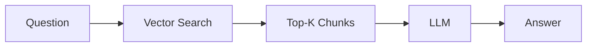

This works poorly for evolving regulation.

Consider the following regulatory history:

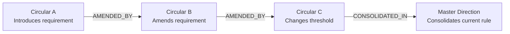

A user asking for the **current requirement** may receive Circular A because its wording is more semantically similar to the query.

The result is relevant retrieval but incorrect regulatory interpretation.

Amend addresses four specific problems.

## 2.1 Fragmentation

A requirement may be spread across:

* circulars,
* notifications,
* amendments,
* master circulars,
* master directions,
* clarifications,
* annexures,
* and FAQs.

## 2.2 Temporal validity

A provision may be correct historically but no longer applicable.

## 2.3 Regulatory relationships

Understanding the rule may require recognizing:

* amendment,
* supersession,
* clarification,
* consolidation,
* withdrawal,
* cross-reference,
* and applicability relationships.

## 2.4 Traceability

Generated answers must allow users to inspect the exact clause and regulatory history supporting each material conclusion.

---

# 3. Product Vision

Amend should behave as a **regulatory reasoning layer**, not a document chatbot.

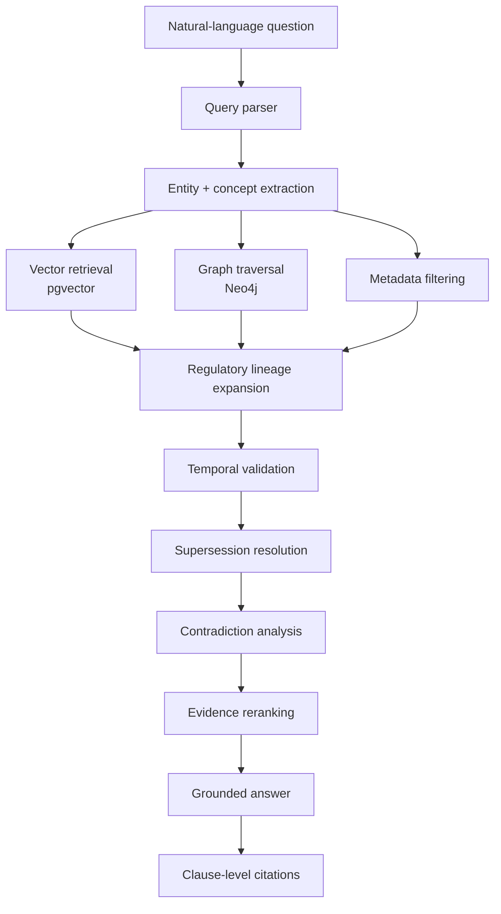

The system must answer:

> **What does the regulation say?**

and:

> **Why is this the provision that applies?**

---

# 4. Product Principles

## 4.1 Evidence before generation

The model must reason from retrieved regulatory evidence rather than generate regulatory assertions from parametric knowledge.

## 4.2 Clauses, not arbitrary chunks

Regulatory structure should be retained wherever possible.

## 4.3 Time is first-class data

Effective dates and regulatory lineage must influence retrieval.

## 4.4 Graph relationships affect truth

An amendment or supersession relationship can be more important than semantic similarity.

## 4.5 Uncertainty must remain visible

Unresolved ambiguity should be surfaced rather than hidden behind confident prose.

## 4.6 Every important claim should be auditable

Users should be able to trace conclusions back to public source material.

---

# 5. Goals

## G1 — Clause-level regulatory retrieval

Retrieve relevant clauses for natural-language regulatory questions.

## G2 — Hybrid graph + vector search

Combine semantic similarity with regulatory relationship traversal.

## G3 — Current-rule resolution

Determine whether retrieved provisions remain applicable.

## G4 — Historical queries

Answer questions based on the regulatory state at a specified point in time.

## G5 — Supersession detection

Identify provisions that have been replaced or modified.

## G6 — Regulatory version diffs

Show how requirements changed between publications.

## G7 — Contradiction detection

Identify apparently incompatible provisions and attempt to resolve them using time, scope, conditions, and lineage.

## G8 — Clause-level citations

Every material regulatory assertion should include traceable evidence.

## G9 — API-first architecture

Expose retrieval and reasoning capabilities through FastAPI.

## G10 — Reproducible deployment

The complete MVP should run using Docker Compose.

---

# 6. Non-Goals

The MVP will not:

* provide legal advice,
* guarantee regulatory compliance,
* replace compliance professionals,
* make autonomous compliance decisions,
* file regulatory reports,
* automatically modify internal policies,
* ingest private organizational documents by default,
* cover all Indian regulators,
* infer obligations without supporting text,
* or claim that generated interpretations are legally authoritative.

Amend is a **regulatory research and evidence system**.

---

# 7. Target Users

## Compliance analyst

Needs to determine which regulatory requirements currently apply.

## Regulatory researcher

Needs to understand the history of a provision.

## Risk or audit professional

Needs inspectable evidence behind regulatory interpretations.

## Engineer

Needs structured regulatory intelligence through APIs.

---

# 8. Core User Stories

## US-01 — Current regulation

As a user, I want to ask:

> What are the current requirements concerning a regulatory topic?

and receive currently applicable clauses rather than obsolete text.

---

## US-02 — Historical regulation

As a user, I want to ask:

> What requirement applied on a particular date?

and receive provisions valid during that period.

---

## US-03 — Exact citations

As a user, I want every material regulatory conclusion linked to the source clause.

---

## US-04 — Regulatory lineage

As a user, I want to understand how a requirement evolved.

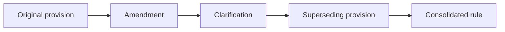

---

## US-05 — Version comparison

As a user, I want to compare two regulatory publications and identify:

* added provisions,
* removed provisions,
* modified provisions,
* changed thresholds,
* changed deadlines,
* changed applicability,
* changed effective dates.

---

## US-06 — Contradiction investigation

As a user, I want Amend to identify conflicting provisions rather than silently choosing one.

---

## US-07 — Applicability

As a user, I want to determine whether a provision applies to a particular class of regulated entity.

---

# 9. Initial Corpus

## Regulators

MVP:

* Reserve Bank of India
* Securities and Exchange Board of India

## Publication types

MVP ingestion should support:

* circulars,
* notifications,
* master circulars,
* master directions,
* amendments,
* clarifications,
* annexures where structurally relevant.

Future scope may include:

* FAQs,
* consultation papers,
* enforcement orders,
* press releases,
* regulatory guidelines.

---

# 10. Ingestion Architecture

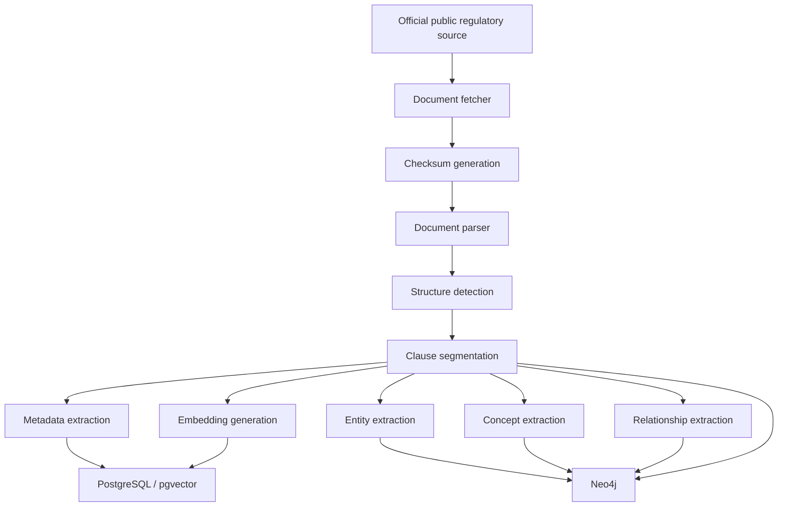

---

# 11. Ingestion Requirements

The ingestion pipeline must be idempotent.

Re-ingesting the same source must not produce duplicate:

* documents,
* clauses,
* embeddings,
* entities,
* or graph relationships.

Each document should have a deterministic identifier derived from stable metadata and/or content hashes.

Store:

```text
document_id
source_url
source_checksum
retrieved_at
parser_version
ingestion_version
publication_date
effective_date
document_type
regulator
```

---

# 12. Document Parsing

The parser should preserve regulatory structure.

Required structural information:

* document title,
* circular/reference number,
* publication date,
* effective date,
* headings,
* clause numbering,
* nested clauses,
* numbered lists,
* page references,
* tables where feasible,
* annexure relationships.

Example:

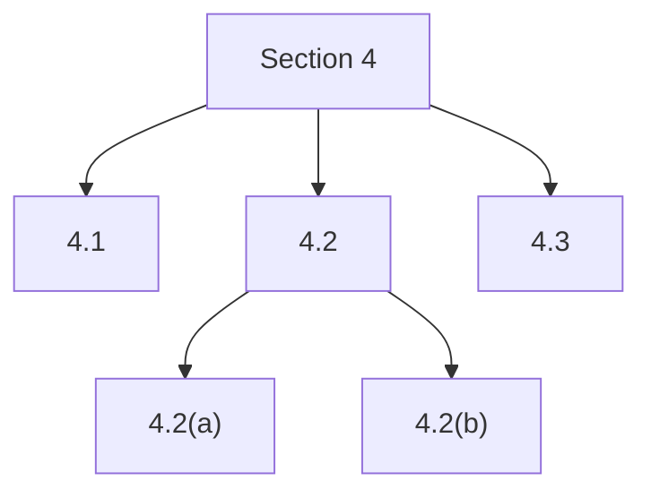

Fixed-size token chunks may be generated as secondary retrieval representations, but they must not become the canonical regulatory units.

---

# 13. Regulatory Knowledge Graph

The graph represents regulatory structure and lineage.

## Core node types

### Regulator

Represents issuing regulatory authorities.

### Document

Properties:

```text
document_id
title
document_type
reference_number
publication_date
effective_date
status
source_url
checksum
```

### Clause

Properties:

```text
clause_id
document_id
clause_number
heading
text
page_number
effective_from
effective_until
status
```

### Entity

Examples:

```text
Commercial Bank
NBFC
Payment Aggregator
Stock Broker
Mutual Fund
Issuer
Listed Entity
Depository Participant
```

### RegulatoryConcept

Examples:

```text
KYC
AML
Cybersecurity
Outsourcing
Liquidity
Disclosure
Reporting
Consumer Protection
Governance
Risk Management
Operational Resilience
```

---

# 14. Knowledge Graph Schema

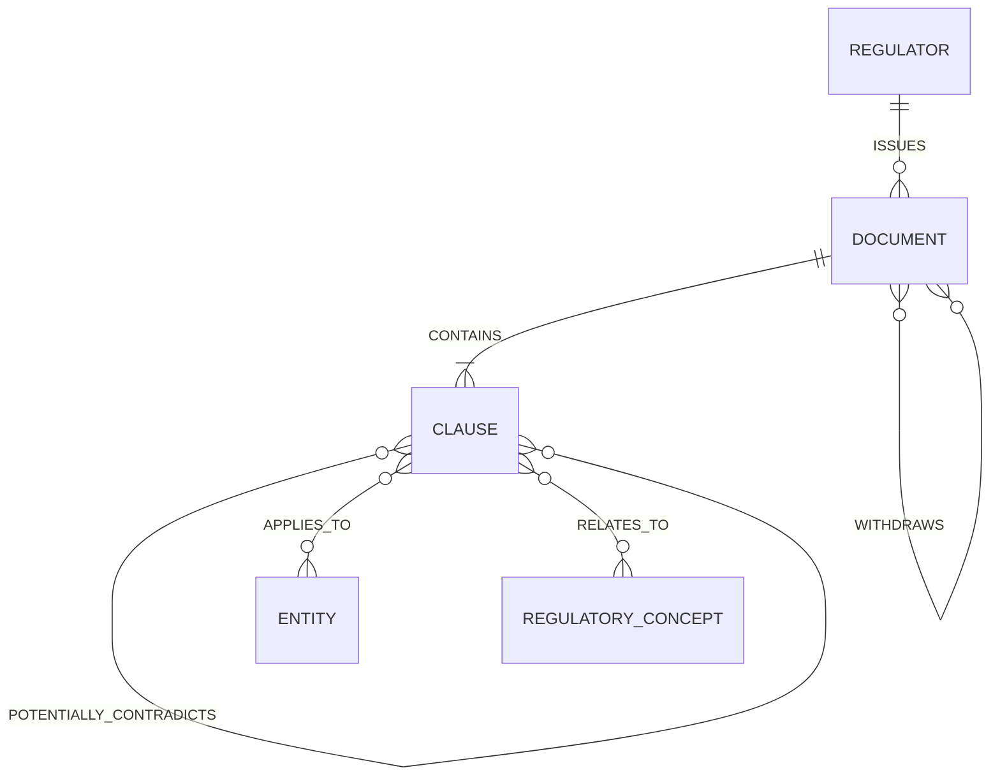

---

# 15. Relationship Provenance

Automatically inferred relationships should include metadata.

Example:

```json
{
  "relationship_type": "SUPERSEDES_CLAUSE",
  "source_clause_id": "clause_123",
  "target_clause_id": "clause_041",
  "extraction_method": "explicit_reference",
  "confidence": 0.98,
  "review_status": "automatic"
}
```

Possible extraction methods:

```text
explicit_reference
metadata
rule_based
llm_extraction
manual_review
```

Graph edges must never be treated as equally reliable without provenance.

---

# 16. Vector Store

Clause embeddings should be stored using pgvector.

Suggested vector metadata:

```json
{
  "clause_id": "clause_x",
  "document_id": "document_x",
  "regulator": "RBI",
  "document_type": "circular",
  "publication_date": "YYYY-MM-DD",
  "effective_from": "YYYY-MM-DD",
  "effective_until": null,
  "status": "active",
  "entities": [],
  "concepts": []
}
```

The vector index performs semantic candidate discovery.

It does not determine regulatory validity.

---

# 17. Query Understanding

Given:

> What are the current requirements for IT outsourcing by banks?

the query interpreter may produce:

```json
{
  "intent": "CURRENT_REQUIREMENT",
  "regulator": "RBI",
  "entities": ["bank"],
  "concepts": ["IT outsourcing"],
  "as_of_date": null
}
```

---

# 18. Query Intent Taxonomy

Initial supported intents:

```text
CURRENT_REQUIREMENT
HISTORICAL_REQUIREMENT
APPLICABILITY
REGULATORY_HISTORY
DOCUMENT_LOOKUP
CLAUSE_LOOKUP
VERSION_DIFF
CONTRADICTION_CHECK
DEFINITION
```

The detected intent determines retrieval behavior.

---

# 19. Hybrid Retrieval Pipeline

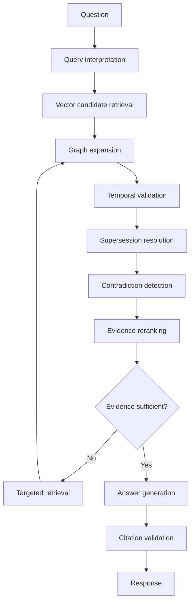

---

# 20. Stage 1 — Vector Retrieval

Use pgvector to retrieve a broad candidate set.

For example:

```text
Top 20–50 clauses
```

The objective at this stage is high recall.

Vector similarity alone must not determine final evidence.

---

# 21. Stage 2 — Graph Expansion

For high-ranking candidates, inspect graph relationships including:

```text
AMENDS
SUPERSEDES
CLARIFIES
CONSOLIDATES
WITHDRAWS
REFERENCES
APPLIES_TO
RELATES_TO
```

For every potentially applicable provision, the system should effectively ask:

> Is there another regulatory publication that changes the meaning or validity of this clause?

---

# 22. Stage 3 — Temporal Validation

For a requested date `T`, a provision is potentially applicable when:

```text
effective_from <= T
AND
(
    effective_until IS NULL
    OR effective_until > T
)
```

This must be combined with graph-based supersession information.

Effective dates should therefore act as one input into regulatory validity, not the sole source of truth.

---

# 23. Stage 4 — Supersession Resolution

Supersession resolution is one of Amend's defining capabilities.

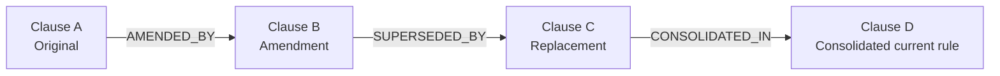

If semantic retrieval returns Clause A for a current-state query, the system should traverse its lineage before including it as primary evidence.

Historical clauses should remain available for:

* regulatory history,
* version comparison,
* and historical queries.

---

# 24. Stage 5 — Evidence Reranking

Candidate evidence should be reranked using configurable signals.

Possible ranking components:

```text
semantic similarity
graph relevance
entity match
concept match
temporal validity
lineage relevance
source authority
explicit reference strength
```

Illustrative scoring model:

```text
score =
    0.35 × semantic_similarity
  + 0.20 × graph_relevance
  + 0.15 × entity_match
  + 0.15 × temporal_validity
  + 0.10 × lineage_relevance
  + 0.05 × source_authority
```

These values are initial hypotheses.

Weights must be evaluated empirically rather than treated as product requirements.

---

# 25. Agent Orchestration — Strands Agents

Most pipeline stages (vector retrieval, graph expansion, temporal validation, supersession resolution, contradiction detection, evidence reranking, citation validation) are deterministic business logic operating on retrieved data. They do not require an LLM and should not be routed through one: doing so would weaken auditability (principle 4.6) and make evidence-before-generation (principle 4.1) harder to enforce.

Only two stages require an LLM:

* **Query understanding** — extracting intent, entities, concepts, and `as_of_date` from natural language.
* **Answer generation** — synthesizing the grounded answer from validated evidence.

These two stages are implemented as [Strands Agents](https://strandsagents.com/) `Agent` instances. The deterministic stages remain plain Python, invoked as a linear pipeline with one explicit retry branch, matching the flow below. This keeps retrieval and validation ordering fully predictable and independent of model behavior, while the LLM layer stays swappable per §70.

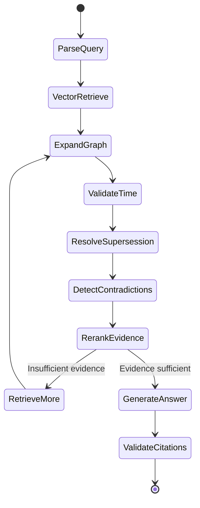

---

# 26. Pipeline State

Suggested state structure, threaded through the deterministic pipeline and passed as context into the Strands query-understanding and answer-generation agents:

```python
class RegulatoryQueryState:
    query: str
    intent: str
    as_of_date: str | None

    regulators: list[str]
    entities: list[str]
    concepts: list[str]

    vector_candidates: list
    graph_candidates: list
    validated_evidence: list

    lineage_results: list
    supersession_results: list
    contradiction_results: list

    answer: str | None
    citations: list
```

---

# 27. Contradiction Detection

Contradiction detection should occur only after applicability and temporal analysis.

Potential contradiction types:

## Direct contradiction

Two provisions impose incompatible requirements during the same period.

## Temporal difference

The provisions differ because one replaced another.

## Scope difference

The provisions apply to different entities.

## Conditional difference

One provision applies only under specific conditions.

## Hierarchical difference

One document explicitly overrides or clarifies another.

## Unresolved contradiction

No reliable explanation is available.

---

# 28. Contradiction Resolution Workflow

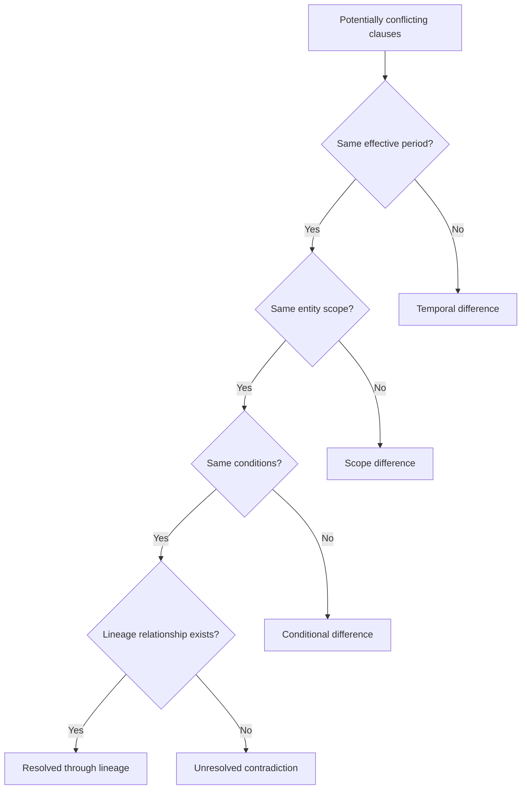

Unresolved contradictions must remain visible in the final answer.

---

# 29. Version Diff Engine

Users should be able to compare two regulatory publications.

Supported change classes:

* added,
* removed,
* modified,
* moved,
* renumbered,
* threshold changed,
* deadline changed,
* applicability changed,
* effective date changed,
* potential semantic change.

Example:

```diff
- Regulated entities must report within 15 days.
+ Regulated entities must report within 7 days.
```

Each diff must preserve references to the source and target clause.

---

# 30. Version Comparison Pipeline

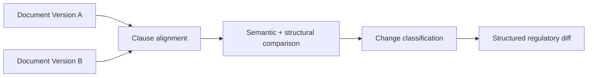

---

# 31. Citation Requirements

Every material regulatory assertion must be supported by evidence.

Suggested citation object:

```json
{
  "document_id": "document_x",
  "document_title": "Regulatory publication",
  "regulator": "RBI",
  "reference_number": "public-reference",
  "publication_date": "YYYY-MM-DD",
  "clause_id": "clause_x",
  "clause_number": "4.2",
  "page": 7,
  "source_url": "official-public-source"
}
```

The frontend may display a shortened citation while preserving the full object internally.

---

# 32. Citation Validation

Before returning an answer, Amend must verify:

1. each material claim has supporting evidence,
2. every citation resolves to a stored clause,
3. direct quotes match source text,
4. the citation was applicable during the requested period,
5. relevant supersession relationships were inspected,
6. no known replacement provision was ignored.

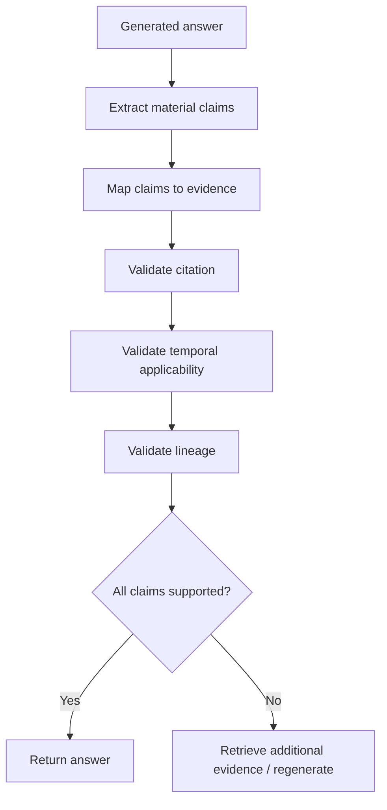

---

# 33. Insufficient Evidence Behaviour

Amend should prefer explicit uncertainty over unsupported synthesis.

Example response:

> The available regulatory evidence is insufficient to determine a single applicable provision confidently.

For unresolved contradictions:

> Two provisions appear inconsistent, and no reliable supersession or scope relationship was found. Both provisions are presented for review.

The system must never invent:

* circular numbers,
* clause numbers,
* effective dates,
* source URLs,
* or regulatory relationships.

---

# 34. Default Answer Structure

Recommended output:

## Answer

Concise explanation of the applicable position.

## Applicable provisions

Numbered regulatory requirements with clause-level citations.

## Regulatory history

Shown when amendments or supersession materially affect the answer.

## Qualifications or conflicts

Show unresolved ambiguity or applicability conditions.

## Sources

Source clauses and public regulatory publications.

---

# 35. API

## Query

```http
POST /v1/query
```

Example request:

```json
{
  "query": "What are the current requirements concerning ...?",
  "regulator": "RBI",
  "as_of_date": null,
  "conversation_id": null,
  "model": {
    "provider": "anthropic",
    "model_id": "claude-sonnet-4-5"
  }
}
```

`model` is required; see [§70 Model Provider Pluggability](#70-model-provider-pluggability) for the error returned when it is omitted. `conversation_id` is optional: omit it (or send `null`) to start a new conversation, or pass a prior response's `conversation_id` to ask a follow-up with that conversation's turns as context. See [§71 Multi-turn Conversations](#71-multi-turn-conversations).

Example response:

```json
{
  "answer": "...",
  "citations": [],
  "applicable_documents": [],
  "regulatory_history": [],
  "contradictions": [],
  "confidence": {
    "overall": 0.91,
    "citation_coverage": 1.0,
    "temporal_validity": 0.95
  },
  "conversation_id": "b3f1c2..."
}
```

---

# 36. Search API

```http
POST /v1/search
```

Returns retrieval results without answer generation.

Potential use cases:

* debugging,
* evaluation,
* custom clients,
* retrieval inspection.

---

# 37. Document API

```http
GET /v1/documents/{document_id}
```

Returns structured document metadata and clause hierarchy.

---

# 38. Clause API

```http
GET /v1/clauses/{clause_id}
```

Returns:

* clause text,
* metadata,
* source,
* applicability,
* connected graph relationships.

---

# 39. Regulatory Lineage API

```http
GET /v1/documents/{document_id}/lineage
```

or:

```http
GET /v1/clauses/{clause_id}/lineage
```

Example conceptual response:

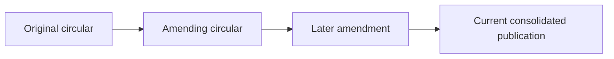

---

# 40. Diff API

```http
GET /v1/documents/{source_id}/diff/{target_id}
```

Returns:

```json
{
  "added": [],
  "removed": [],
  "modified": [],
  "renumbered": [],
  "semantic_changes": []
}
```

---

# 41. Health API

```http
GET /health
```

Should report availability of:

* API,
* PostgreSQL,
* Neo4j,
* embedding service,
* model service where relevant.

---

# 42. System Architecture

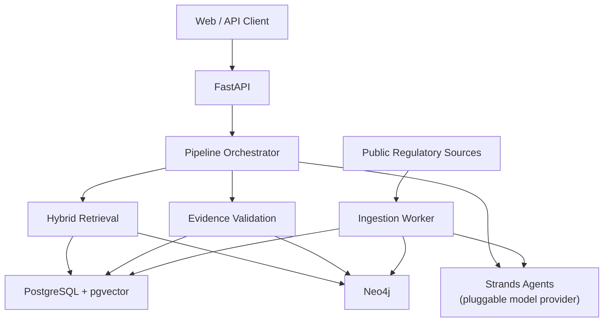

---

# 43. Storage Responsibilities

## PostgreSQL

Store:

* document metadata,
* clauses,
* ingestion state,
* parser state,
* source information,
* evaluation data,
* query telemetry.

## pgvector

Store:

* clause embeddings,
* semantic retrieval representations.

## Neo4j

Store:

* regulatory lineage,
* clause relationships,
* document relationships,
* entities,
* regulatory concepts,
* applicability relationships.

---

# 44. Deployment Architecture

Minimum Docker Compose services:

```yaml
services:
  api:
  worker:
  postgres:
  neo4j:
  redis:
```

`redis` backs the rate limiter (§45) and is required once more than one `api` instance runs; a single-instance development deployment could substitute an in-memory limiter, but the reference deployment always includes it so behavior matches production.

Optional services:

```yaml
  model:
  object-storage:
```

Expected developer workflow:

```bash
docker compose up
```

API documentation should be exposed through FastAPI's OpenAPI interface.

Deployment hostnames and infrastructure-specific identifiers must remain configurable and must not be hard-coded into the repository.

---

# 45. Security Requirements

Even though the MVP uses public regulatory material, the application should follow secure defaults.

Requirements:

* API credentials via environment variables,
* Amend-issued API key authentication on any endpoint that reads or writes caller-scoped state (§70.1),
* encrypted storage of caller-supplied model provider credentials (§70.2),
* database authentication,
* network isolation for databases,
* URL validation for ingestion,
* input validation,
* rate limiting,
* safe Cypher query construction,
* HTML sanitization,
* file-size limits,
* controlled outbound requests,
* dependency pinning.

User input must never be directly converted into arbitrary Cypher queries.

## 45.1 Rate limiting

Token bucket, Redis-backed so limits hold across multiple `api` instances. Keyed by the caller's Amend API key for authenticated endpoints; keyed by source IP for the small set of unauthenticated endpoints (`GET /health`). A request that exceeds its bucket receives `429 Too Many Requests` with a `Retry-After` header.

Default limits (`RATE_LIMIT_REQUESTS_PER_MINUTE`, `RATE_LIMIT_BURST` in `.env`) are a starting point, not a tuned production value: they should be revisited once real traffic patterns and per-provider cost exist, since `/v1/query` cost is dominated by the caller's own model provider usage, not Amend's infrastructure.

---

# 46. Prompt Injection Protection

Regulatory documents should be treated as **untrusted data**.

Instructions appearing inside source documents must never override application prompts or system behavior.

The model should receive source material explicitly marked as evidence.

The generation layer should distinguish:

```text
instructions
from
retrieved regulatory evidence
```

---

# 47. PII Requirements

The product and repository should remain PII-free by default.

Do not hard-code:

* personal names,
* email addresses,
* phone numbers,
* private domains,
* private API credentials,
* local machine usernames,
* personal filesystem paths.

Documentation should use neutral examples such as:

```text
example.com
user@example.com
/document/path
```

where placeholders are required.

Query logs should avoid unnecessary storage of user-identifying information.

---

# 48. Source Integrity

Every ingested document should retain provenance.

Store:

```text
source_url
retrieval_timestamp
content_checksum
parser_version
ingestion_timestamp
```

Recommended:

```text
SHA-256 document checksum
```

This supports reproducibility if the public source later changes.

---

# 49. Entity Normalization

Equivalent regulatory entity names should map to canonical entities.

Example:

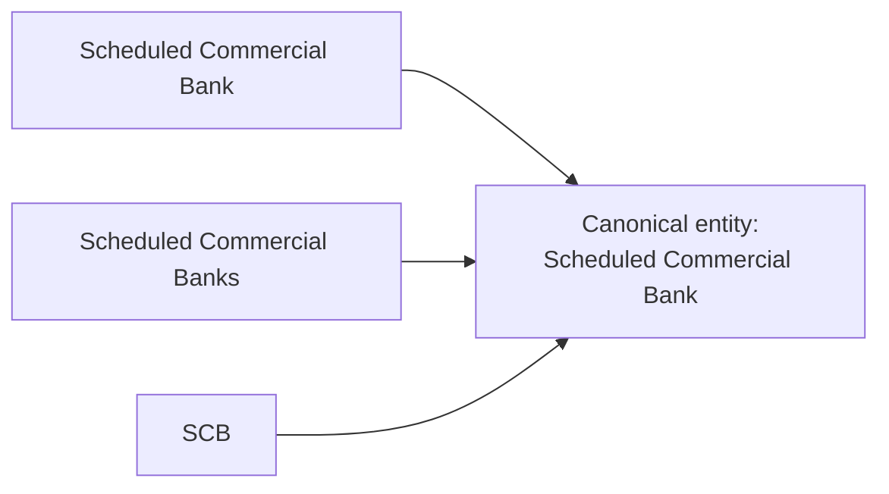

The original source wording must still be preserved.

---

# 50. Regulatory Concept Taxonomy

Initial concept taxonomy may include:

```text
KYC
AML
Capital Adequacy
Liquidity
Cybersecurity
IT Governance
Outsourcing
Operational Resilience
Consumer Protection
Payments
Disclosure
Reporting
Fraud Management
Data Retention
Governance
Risk Management
Market Conduct
```

The taxonomy must remain extensible.

---

# 51. Confidence Model

Confidence should reflect evidence quality rather than raw model certainty.

Potential dimensions:

```text
retrieval confidence
citation coverage
temporal certainty
lineage completeness
contradiction resolution
```

Example:

```json
{
  "overall": 0.89,
  "retrieval": 0.93,
  "citation_coverage": 1.0,
  "temporal_validity": 0.92,
  "lineage_confidence": 0.83
}
```

Confidence scores should be calibrated against the evaluation dataset before being exposed as authoritative metrics.

---

# 52. Observability

Each query should produce structured internal telemetry.

Recommended fields:

```text
query_id
intent
extracted_entities
extracted_concepts
requested_date
vector_candidates
graph_candidates
validated_evidence
supersession_checks
contradiction_checks
final_citations
latency
token_usage
```

This supports debugging questions such as:

> Why was this clause retrieved?

without exposing private model chain-of-thought.

## 52.1 Retention

Query telemetry is retained for `TELEMETRY_RETENTION_DAYS` (default `7`) before deletion, to satisfy the PII-minimization requirement in §47 while still allowing short-term debugging. A scheduled purge job deletes telemetry rows older than the configured window; the window is a deployment-level configuration choice, not a hardcoded constant, so a deployment with different compliance requirements can extend or shorten it. Evaluation data (§59) is a separate, deliberately-curated dataset and is not subject to this retention window.

---

# 53. Evaluation Strategy

Generic RAG evaluation alone is insufficient.

Amend must separately evaluate:

* retrieval,
* citation accuracy,
* temporal correctness,
* supersession resolution,
* contradiction analysis,
* answer grounding.

---

# 54. Retrieval Metrics

Measure clause-level:

```text
Recall@K
MRR
nDCG
```

Primary focus should be Recall@10 and Recall@20 during early development.

---

# 55. Citation Metrics

## Citation correctness

Does the cited clause support the corresponding claim?

## Citation completeness

What proportion of material regulatory claims have citations?

Target:

```text
≥ 98% citation completeness
```

with an aspirational target of 100% for material regulatory claims.

---

# 56. Temporal Accuracy

Evaluation examples should explicitly test outdated provisions.

Example:

```text
Question:
What requirement applied on 1 January 2024?

Expected:
Clause B

Incorrect:
Clause A, which had already been superseded.
```

---

# 57. Supersession Accuracy

Benchmark cases should test whether Amend correctly resolves chains such as:

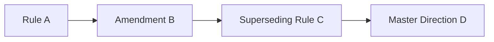

---

# 58. Contradiction Evaluation

The benchmark should contain examples of:

* genuine contradictions,
* temporal differences,
* scope differences,
* conditional differences,
* equivalent paraphrases,
* amendments,
* unresolved ambiguity.

---

# 59. Evaluation Dataset

MVP target:

```text
150–250 manually verified questions
```

Cover:

* RBI,
* SEBI,
* straightforward retrieval,
* cross-document questions,
* regulatory history,
* current-rule queries,
* historical queries,
* supersession,
* contradiction cases,
* applicability cases.

Example schema:

```json
{
  "question": "...",
  "intent": "CURRENT_REQUIREMENT",
  "as_of_date": null,
  "expected_clause_ids": [],
  "expected_lineage": [],
  "expected_answer_points": [],
  "contradiction_expected": false
}
```

---

# 60. Baseline Comparison

A critical evaluation should compare:

### Baseline

Vector-only RAG.

### Amend

Vector retrieval + graph traversal + temporal reasoning + supersession resolution.

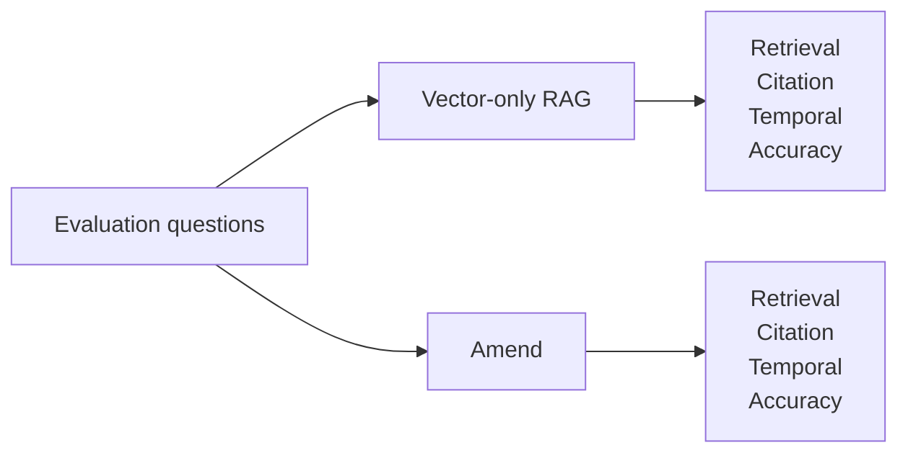

This comparison should demonstrate whether graph grounding materially improves regulatory correctness.

---

# 61. MVP Success Metrics

| Metric                           |      Target |
| -------------------------------- | ----------: |
| Clause Recall@10                 |       ≥ 90% |
| Citation completeness            |       ≥ 98% |
| Citation correctness             |       ≥ 95% |
| Temporal-query accuracy          |       ≥ 90% |
| Supersession resolution accuracy |       ≥ 90% |
| Unsupported regulatory claims    |        < 2% |
| Median end-to-end latency        | < 8 seconds |

These targets should be revised once a representative benchmark exists.

---

# 62. Performance Targets

Initial targets:

```text
Vector search           < 500 ms
Graph expansion         < 500 ms
Hybrid retrieval        < 1.5 s
Typical full response   < 8 s
```

Latency should be tracked by pipeline stage.

---

# 63. Repository Structure

Monorepo: `api/` and `web/` are independent projects, each with its own dependency manifest; `docs/`, `docker-compose.yml`, and `.env.example` at the root describe or orchestrate the whole system rather than belonging to either. Rationale: [docs/decisions/0002-monorepo-layout.md](./decisions/0002-monorepo-layout.md).

```text
amend/
│
├── api/
│   ├── app/
│   │   ├── api/
│   │   │   ├── routes/
│   │   │   └── dependencies.py
│   │   │
│   │   ├── graph/
│   │   │   ├── queries.py
│   │   │   ├── lineage.py
│   │   │   ├── supersession.py
│   │   │   └── contradictions.py
│   │   │
│   │   ├── retrieval/
│   │   │   ├── vector.py
│   │   │   ├── graph.py
│   │   │   ├── hybrid.py
│   │   │   └── reranker.py
│   │   │
│   │   ├── pipeline/
│   │   │   ├── pipeline.py
│   │   │   ├── state.py
│   │   │   └── stages/
│   │   │
│   │   ├── agents/
│   │   │   ├── models.py          # Strands model provider factory/registry
│   │   │   ├── credentials.py     # BYOK credential resolution (§70.2)
│   │   │   ├── query_agent.py     # query understanding (Strands Agent)
│   │   │   └── answer_agent.py    # grounded answer generation (Strands Agent)
│   │   │
│   │   ├── ingestion/
│   │   │   ├── loaders/
│   │   │   ├── parser.py
│   │   │   ├── clauses.py
│   │   │   ├── entities.py
│   │   │   ├── concepts.py
│   │   │   └── relationships.py
│   │   │
│   │   ├── models/
│   │   ├── schemas/
│   │   └── config.py
│   │
│   ├── evaluation/
│   │   ├── dataset.json
│   │   ├── retrieval.py
│   │   ├── citations.py
│   │   ├── temporal.py
│   │   └── contradictions.py
│   │
│   ├── tests/
│   ├── scripts/
│   ├── Dockerfile
│   ├── pyproject.toml
│   ├── uv.lock
│   └── README.md
│
├── web/
│   └── README.md              # placeholder until a frontend stack is chosen
│
├── docs/
│   ├── PRD.md
│   ├── ARCHITECTURE.md
│   ├── DATA_MODEL.md
│   ├── CODING_STANDARDS.md
│   └── decisions/
│
├── .github/workflows/
├── docker-compose.yml
├── .env.example
├── AGENTS.md
└── README.md
```

---

# 64. Implementation Phases

## Phase 1 — Corpus and parsing

Build:

* regulatory source ingestion,
* document parsing,
* metadata extraction,
* clause segmentation,
* deterministic IDs.

### Exit criterion

Documents can be reliably transformed into structured clauses.

---

## Phase 2 — Vector retrieval

Build:

* embedding generation,
* pgvector storage,
* semantic search,
* metadata filtering.

### Exit criterion

Relevant clauses achieve acceptable Recall@K on the initial benchmark.

---

## Phase 3 — Regulatory graph

Build:

* document nodes,
* clause nodes,
* entities,
* concepts,
* amendment relationships,
* supersession relationships.

### Exit criterion

Regulatory lineage can be reconstructed through graph traversal.

---

## Phase 4 — Hybrid retrieval

Combine:

* vector candidates,
* graph expansion,
* applicability checks,
* evidence reranking.

### Exit criterion

Hybrid retrieval outperforms the vector-only baseline on lineage-dependent questions.

---

## Phase 5 — Temporal reasoning

Implement:

* effective-date reasoning,
* historical as-of queries,
* current-rule resolution.

### Exit criterion

Historical and current queries correctly differentiate regulatory versions.

---

## Phase 6 — Contradiction engine

Implement:

* candidate contradiction generation,
* scope comparison,
* temporal comparison,
* lineage reconciliation,
* unresolved conflict reporting.

### Exit criterion

Known test contradictions are correctly categorized.

---

## Phase 7 — Answer generation

Implement LangGraph orchestration for:

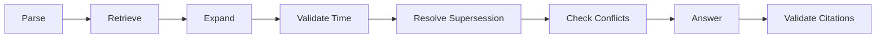

### Exit criterion

End-to-end questions return grounded answers with valid citations.

---

## Phase 8 — Evaluation and hardening

Build:

* benchmark suite,
* baseline comparison,
* retrieval telemetry,
* latency monitoring,
* regression tests.

### Exit criterion

MVP success thresholds are met.

---

# 65. MVP Scope

The MVP must include:

### Corpus

* public RBI regulatory publications,
* public SEBI regulatory publications.

### Parsing

* structured metadata,
* clause-level segmentation.

### Retrieval

* pgvector semantic search,
* Neo4j graph traversal,
* metadata filtering,
* hybrid reranking.

### Regulatory reasoning

* applicability,
* temporal validation,
* supersession resolution,
* contradiction analysis.

### Answers

* grounded synthesis,
* clause-level citations,
* regulatory history where relevant.

### API

* FastAPI,
* OpenAPI documentation.

### Deployment

* Docker Compose.

---

# 66. Post-MVP Opportunities

## Regulatory timelines

Interactive visual histories of rules.

## Change monitoring

Detect newly published circulars and identify concepts or existing rules they affect.

## Control mapping

Map regulations to internal control frameworks.

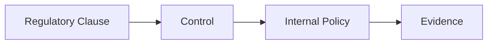

## Obligation extraction

Transform regulatory clauses into structured obligations.

Example:

```json
{
  "subject": "regulated entity",
  "action": "submit report",
  "object": "incident details",
  "deadline": "specified duration",
  "conditions": []
}
```

## Additional regulators

Potential future coverage:

* IRDAI,
* PFRDA,
* MCA,
* FIU-IND,
* MeitY.

---

# 67. Product Risks

## Incorrect graph edges

A false supersession relationship could hide a valid provision.

### Mitigation

* provenance,
* confidence scores,
* explicit-reference preference,
* reviewable graph edges.

## Parser errors

Complex regulatory PDFs may lose structural information.

### Mitigation

* parser quality metrics,
* structural validation,
* source previews,
* regression fixtures.

## Hallucinated interpretations

### Mitigation

* evidence-constrained generation,
* citation validation,
* unsupported-answer refusal.

## False contradiction detection

Different provisions may target different entities.

### Mitigation

Applicability checks must precede contradiction classification.

## Incomplete regulatory lineage

A missing document could cause an obsolete provision to appear active.

### Mitigation

* ingestion completeness monitoring,
* source coverage metrics,
* conservative confidence scoring.

---

# 68. MVP Acceptance Criteria

Amend is considered MVP-ready when a user can ask:

> What is the current regulatory requirement concerning a given topic?

and the system:

1. identifies the regulatory concept,
2. identifies applicable entity classes,
3. retrieves relevant clauses,
4. discovers connected regulatory publications,
5. checks publication and effective dates,
6. identifies amendments,
7. identifies superseding provisions,
8. filters or contextualizes obsolete evidence,
9. checks remaining evidence for contradictions,
10. generates a grounded answer,
11. provides clause-level citations,
12. provides source links,
13. exposes relevant regulatory lineage,
14. and refuses to invent unsupported regulatory claims.

---

# 69. Defining Product Test

The defining test for Amend is not:

> **Did the system retrieve a relevant paragraph?**

It is:

> **Did Amend identify the provision that actually applied, explain how it reached that version, and provide evidence that can be independently audited?**

That distinction is the product.

---

# 70. Model Provider Pluggability

The LLM layer must not be bound to a single provider, and must not be bound to a single caller's credentials. [Strands Agents](https://strandsagents.com/) provides first-class, pluggable support for Amazon Bedrock, Anthropic, OpenAI, Gemini, Ollama, and other providers behind a common `Agent` interface. Amend uses this to let the chat model backing query understanding and answer generation be chosen per request, using credentials the caller supplies, not credentials the deployment operator provisions in advance.

This is a bring-your-own-key (BYOK) design: the deployment declares which provider *integrations* it supports, but each caller supplies their own API key for the provider(s) they want to use, and Amend stores that key encrypted, scoped to the caller.

## 70.1 Configuration model

* Each deployment declares an **allowlist of supported provider integrations** via `ENABLED_MODEL_PROVIDERS` (for example `anthropic,openai,gemini,ollama`). This controls which provider SDKs/extras are installed and which providers `POST /v1/credentials` will accept, not who may use them.
* There is **no server-configured default model**. A `POST /v1/query` request that omits `model` is rejected:

  ```json
  {
    "error": "model_required",
    "message": "No model specified. Include `model.provider` and `model.model_id` in the request, choosing from the credentials you have configured (see GET /v1/models)."
  }
  ```

  Amend never silently substitutes a provider or model the caller did not ask for.
* Every request to `/v1/query`, `/v1/credentials`, and any endpoint that reads or writes caller-scoped state must be authenticated with an Amend-issued API key (`Authorization: Bearer <key>`). This is a new requirement introduced by BYOK: storing a caller's provider credentials requires knowing, and authenticating, who the caller is. Amend's own API keys are opaque tokens, stored hashed (never in plaintext), issued through an out-of-band admin process for the MVP (a self-service signup/key-issuance flow is a post-MVP concern, not required to satisfy this requirement).

## 70.2 Credential storage

```http
POST /v1/credentials
```

Request:

```json
{
  "provider": "anthropic",
  "api_key": "sk-ant-..."
}
```

Response (the key is never echoed back):

```json
{
  "provider": "anthropic",
  "configured": true,
  "key_suffix": "...wxyz",
  "created_at": "2026-08-07T00:00:00Z"
}
```

```http
DELETE /v1/credentials/{provider}
```

Removes the caller's stored credential for that provider.

Storage rules:

* The submitted key is encrypted at rest (envelope encryption, AES-GCM via `cryptography.fernet`) using a master key (`CREDENTIAL_ENCRYPTION_KEY`) held only in the deployment's secret store, never in the database. See [docs/DATA_MODEL.md](./DATA_MODEL.md) for the `model_credentials` table.
* A credential is scoped to exactly one `(caller, provider)` pair. Amend decrypts it in memory for the duration of a single request and never writes the decrypted value to logs, telemetry, or error messages.
* `GET /v1/models` returns, for the authenticated caller, the supported providers and whether that caller has a credential configured for each (`configured: true/false`) plus each provider's known model IDs, so the UI can populate a selection control and prompt for missing credentials.
* If `POST /v1/query` specifies a provider the caller has not configured, the API returns `424 Failed Dependency` with a message directing them to `POST /v1/credentials`, not a fallback to any other provider.

## 70.3 Model factory

`api/app/agents/models.py` resolves an authenticated caller's `(provider, model_id)` request into a Strands model object by looking up and decrypting that caller's stored credential:

```python
from strands.models.anthropic import AnthropicModel
from strands.models.openai import OpenAIModel

def build_model(provider: str, model_id: str, api_key: str, params: dict | None = None):
    if provider == "anthropic":
        return AnthropicModel(
            client_args={"api_key": api_key},
            model_id=model_id,
            params=params or {},
        )
    if provider == "openai":
        return OpenAIModel(
            client_args={"api_key": api_key},
            model_id=model_id,
            params=params or {},
        )
    raise UnsupportedProviderError(provider)
```

`api_key` here is the caller's decrypted credential, resolved just before this call and not retained beyond the request. The `query_agent` and `answer_agent` (§25) are constructed per request with the resolved model, keeping the rest of the pipeline provider-agnostic.

## 70.4 Embedding model pluggability

Embeddings are pluggable too, but the constraint is different from chat models: a clause's stored embedding is only comparable to a query embedding produced by the **same** model and dimension. This means embedding choice cannot be a free-form per-request UI toggle the way the chat model is; it is a choice among the embedding indexes the deployment has actually built.

* **Ingestion time (deployment-owned):** the corpus is embedded once, offline, by the ingestion worker, using `INGESTION_EMBEDDING_PROVIDER` / `INGESTION_EMBEDDING_MODEL_ID` / `INGESTION_EMBEDDING_API_KEY` (deployment-level env configuration, not BYOK, since the corpus is shared across all callers). A deployment may maintain more than one embedding index (for example, to evaluate a new embedding model against the current one per §60) by running ingestion again with a different embedding model into a separate table; see [docs/DATA_MODEL.md](./DATA_MODEL.md).
* **Query time:** `GET /v1/models` also returns the embedding models that currently have a built index, each identified by an `embedding_model_id`. A caller may pass `retrieval.embedding_model_id` in `POST /v1/query` to select which index to search; omitting it uses the deployment's single default index (most deployments will only maintain one). The query text is embedded with that same model before the vector search stage (§20).
* Switching the active embedding index does not require caller-supplied credentials: it selects among indexes the deployment already built, it does not call an embedding model on the caller's behalf.

## 70.5 Constraints

* Switching providers or models must not change citation validation (§32) or evidence-before-generation (principle 4.1) behavior: those are enforced in deterministic pipeline code, not delegated to the model.
* Provider/model identity (and embedding index identity, when more than one exists) should be recorded in query telemetry (§52) to support evaluation comparisons across models, without recording the caller's credential or its plaintext value.
* A caller's stored credentials are visible and revocable only to that caller; no endpoint returns another caller's credential metadata.

---

# 71. Multi-turn Conversations

`POST /v1/query` accepts an optional `conversation_id`. Omitting it starts a new conversation; passing a prior response's `conversation_id` asks a follow-up question with that conversation's recent turns available as context to query understanding (§25). Each turn still runs the full pipeline independently, including its own temporal validation, supersession resolution, and citation validation: a follow-up is not exempt from evidence-before-generation just because it references an earlier turn.

Design rationale and the evaluation of related agent-runtime capabilities (memory, streaming, hooks, and so on) that this decision sits alongside: [docs/decisions/0001-agent-runtime-capabilities.md](./decisions/0001-agent-runtime-capabilities.md).

Storage: [docs/DATA_MODEL.md](./DATA_MODEL.md), `conversations` and `conversation_turns`.
